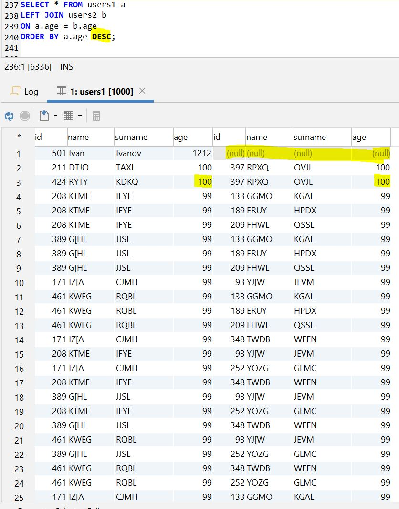

<h1 align="center">ДЗ 12</h1>
<h1 align="center">MySQL join</h1>

---
### Create table ###
```sql
--Создал 2 таблицы для теста
CREATE TABLE users1 (
  id MEDIUMINT(8) UNSIGNED NOT NULL AUTO_INCREMENT,
  name VARCHAR(200) NOT NULL,
  surname VARCHAR(200) NOT NULL,
  age INT NOT NULL,
  PRIMARY KEY (id)
) ENGINE=INNODB;

CREATE TABLE users2 (
  id MEDIUMINT(8) UNSIGNED NOT NULL AUTO_INCREMENT,
  name VARCHAR(200) NOT NULL,
  surname VARCHAR(200) NOT NULL,
  age INT NOT NULL,
  PRIMARY KEY (id)
) ENGINE=INNODB;
```

### Create procedure (заполняем таблицу) ###
```sql
-- numlines - кол-во строк, tableName - имя таблицы в которую хотим добавить эти строки
DELIMITER //
CREATE PROCEDURE filltable (IN numlines INT, IN tableName VARCHAR(64))
BEGIN
  DECLARE i INT DEFAULT 0;
  DECLARE a,b VARCHAR(11);
    while (i<numlines) do
      SELECT CHAR(65+rand()*26,65+rand()*26,65+rand()*26,65+rand()*26 USING utf8)INTO a;
      SELECT CHAR(65+rand()*26,65+rand()*26,65+rand()*26,65+rand()*26 USING utf8)INTO b;
      SET @t1 =CONCAT('INSERT INTO ',tableName,' (name, surname, age) VALUES (\'',a,''',', '\'',b,'\', rand()*100);');
      PREPARE stmt3 FROM @t1;
      EXECUTE stmt3;
      DEALLOCATE PREPARE stmt3;
      set i=i+1;
    end while;
END
//
--Заполняем таблицу
CALL filltable (500, 'users1');
CALL filltable (500, 'users2');
```
### Inner join ###
Будут возвращены все строки для которых совпадает значение поля id в обоих таблицах
```sql
SELECT * FROM users1 a
INNER JOIN users2 b
ON a.id = b.id
ORDER BY a.age;
```


### Left join ###
Когда вы подключаетесь к таблицам t1 и t2, используя оператор LEFT JOIN, если строка из левой таблицы t1 соответствует строке из правой таблицы t2 на основе условия соединения (t1.c1 = t2.c1), эта строка будет включена в результирующий набор.
Если значение в левой таблице не соответствует значению в правой таблице, строка в левой таблице также выбирается и объединяется с «условной» строкой из правой таблицы. «Условная» строка содержит NULL для всех соответствующих столбцов в операторе SELECT
```sql
--Строки с age 1212 во второй таблице нет, поэтому заполнено null
--остальные строки имеют соответствие по полю age в двух таблицах
SELECT * FROM users1 a
LEFT JOIN users2 b
ON a.age = b.age
ORDER BY a.age DESC;
```


### WHERE с использованием разных операторов ###
```sql
--1)
SELECT * FROM users1 a
LEFT JOIN users2 b
ON a.age = b.age
WHERE a.age = 0;
ORDER BY a.age;
--2)
SELECT * FROM users1 a
LEFT JOIN users2 b
ON a.age = b.age
WHERE a.surname LIKE 'WX%';
ORDER BY a.age;
--3)
SELECT * FROM users1 a
LEFT JOIN users2 b
ON a.age = b.age
WHERE ((b.age > 30) AND (a.surname='JUTI' OR b.surname='HNVO');
ORDER BY a.surname;
--4)
SELECT * FROM users1 a
LEFT JOIN users2 b
ON a.age = b.age
WHERE (b.age > 30) AND (a.surname='JUTI' OR b.surname='HNVO')
AND a.id BETWEEN 100 AND 250;
ORDER BY a.surname;
--5)
SELECT * FROM users1 a
LEFT JOIN users2 b
ON a.age = b.age
WHERE b.surname IS NULL;
ORDER BY a.age;
```

| Database   | ver    |
| -----      | ---    |
| MySQL      | 8.0.15 |
